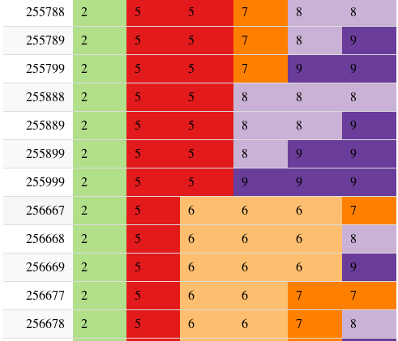

Diary: Advent of Code 2019
================

Notes about functions/arguments I’d not come across before. And any
other thoughts. Full solutions can be found in, e.g., `01.R`, `02.R`,
etc.

# Day 15

Part I of Day 15 was nice - a little bit of thinking and experimenting, but in the end ~10 lines of code.

Now Part II was very tricky. The worst part was that it seemed hint that it relies on Part I, whereas really, it was a completely different puzzle. After struggling for a while, I went online for tips. Then played around quite a bit to convince myself of the solution and to code my own, rather than just copying what I'd seen. In the end, the solution was again ~10 lines of code, but many more were written in exploration/testing. I guess I now know some modular arithmetic.

# Day 12

After setting my Part II to run - went on Twitter to see what the chat about this had been. Realised that my solution would not be finished this decade, as it would require around quadrillion iterations. Reworked to calculate the phase for each coordinate separately, then used the smallest common multiple function (scm) from `library(schoolmath)` - again, as suggested by people on Twitter :)


# Day 10

Now this was a proper refresher on vector geometry.

Cool new function: `tidyr::crossing()` puts two tibbles together in every possible way, so every line gets matched with every line from the other tibble. Like a full join without a shared variable.

# Day 9

This was really easy as well - going back to the Intcode Computer, adding a bit more functionality. Part II was the exact same thing as Part II, just a different input value. But the program ran for a long time (didn't time it but several minutes I think).

# Day 8

Phew, happy Sunday. This one was really simple. Part I was just `count()` and `filter()`, Part II just `ggplot()`, `geom_tile()` and knowing that NA can be used as a transparent colour/fill: `scale_fill_manual(values = c("white", "black", NA))` 


# Day 7

Day 7 was horrendous, finished it but...do not look at the code. 

# Day 6

I've not done network analysis before but I had a feeling today's challenge is a single-liner if using the right tools.

So it was:

```r

read_delim("06-input", delim = ")", col_names = c("from", "to")) %>% 
  graph_from_data_frame(directed = TRUE) %>% 
  distances(to = "COM") %>%
  sum()

```
`distances()` is the only real workhorse here, other lines are just read and convert the input to a graph object. I used `distances()` for Part II too (`v = YOU_orbits, to = SAN_orbits`).

# Day 5

Skipped this at first, now completed after doing Day 6 first.

Didn't learn anything other than that indexing from 0 is a pain :D #datascience

# Day 4

Solved it programmatically, but used datatable and backgroundColor to
debug: <http://rpubs.com/riinu/day04>

Example of a mistake:



Solution had no for loops, just two filters:

```r
data %>% 
  filter(
      c2 >= c1 &
      c3 >= c2 &
      c4 >= c3 &
      c5 >= c4 &
      c6 >= c5
  ) %>%
  filter(
      (c2 == c1 & c2 != c3)|
      (c3 == c2 & (c3 != c4 & c2 != c1))|
      (c4 == c3 & (c4 != c5 & c3 != c2))|
      (c5 == c4 & (c5 != c6 & c4 != c3))|
      (c6 == c5 & (c5 != c4 & c5 != c4))
  )
```

# Day 3

Learning from the time I spent in vain the previous day trying to make
the exercise conform to R (they’re not data science challenges…), I
decided to do things my way.

My solution was super fast an fun - plot it and pick the answers from
the
plot:


Dummy code to show that sometimes gganimate is just a single line
(`transition_reveal(var)`):

``` r
library(tidyverse)
library(gganimate)

data %>% 
  ggplot(aes(x = x, y = y, group = something)) +
  geom_path(alpa = 0.5) +
  transition_reveal(index_var)
```

This creates a bunch of png files, I then used imagemagick to convert:

`convert *.png output.gif` (or `Sys("convert *.png output.gif")` in an R
script)

After meditating over the gif a bit, I used `plotly::ggplotly()` to
interact with the plot (zoom + hover over points for intersection
coordinates).  
Simple, but works. `¯\_(ツ)_/¯`

# Day 2

`melt_csv()` - input was in rows, but this “melts” them into columns.
Sweet\!

Tried really hard to make the solution look like proper R code, with
maps rather than for loops etc. Gave up and bashed out a nested for loop
with heavy use of `[` `]` for indexing.

Added +1 to every coordinate as instructions start counting from 0, R
(and Fortran, for that matter) starts from 1.

# Day 1

new R function (new for me…): `scan("input_file")` - reads into a simple
vector rather than a proper table/data frame/tibble
